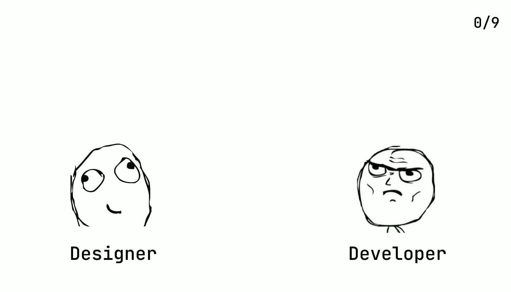
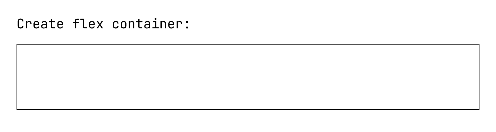
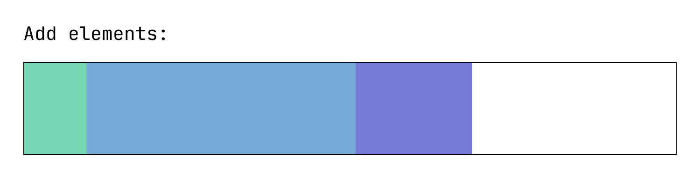
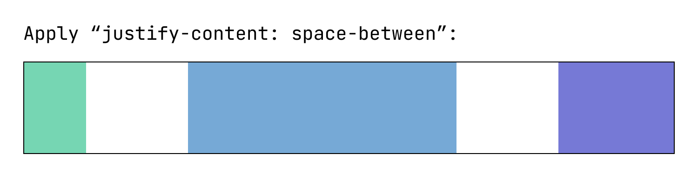
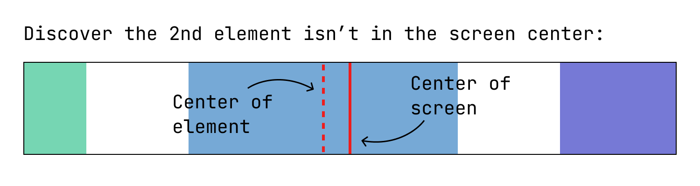

<p align="center">
    <a href="https://center-that-thing.vercel.app/"></a>
</p>

# 🫸 Center. That. Thing! 🫷

Centers any HTML element horizontally – **relative to the screen!**

Try out the demo: [Show. Me. THE. DEMO!!! 🔗](https://center-that-thing.vercel.app/)

Who is this favor?

- For you my, dear **designers**! ❤️ Tell your developer colleagues to use this library.
- For you, my dear **developer colleagues**. ❤️ Don't be afraid to implement this annoying centered thing anymore. Just
  use this library.

⬇️ Check out this lovely GIF:



# 📖 Table of contents

<!-- TOC -->

* [🫸 Center. That. Thing! 🫷](#-center-that-thing-)
* [📖 Table of contents](#-table-of-contents)
* [🧑‍💻 Usage](#-usage)
    * [Add the script](#add-the-script)
    * [Center using JS](#center-using-js)
    * [Center using HTML attributes](#center-using-html-attributes)
    * [Center using CSS (yes!)](#center-using-css-yes)
    * [Dynamic elements](#dynamic-elements)
* [🛠️ Options](#-options)
* [🛟 The problem](#-the-problem)
* [💡 How it works](#-how-it-works)
* [💥 Collision detection](#-collision-detection)
* [⛔️ Issues](#-issues)
* [✍️ Author](#-author)

<!-- TOC -->

# 🧑‍💻 Usage

Assumptions:

- You are able to add a JavaScript library to your website's/project's `<head>`.
- You can add IDs or classes to elements respectively extract element IDs.
- You can do **at least one** of the following:
    - Execute some JavaScript at the end of your page.
    - Add custom HTML attribute to HTML elements.
    - Adjust the global CSS.

## Add the script

Add the following script to one or every page:

```html
<script src="https://cdn.jsdelivr.net/gh/peter-kuhmann/center-that-thing@latest/dist/center-that-thing.js"></script>
```

## Center using JS

To center a specific element by executing some JavaScript, use:

```javascript
// Use element reference
centerThatThing(myElementToCenter, { /* options */})

// Use CSS selector
centerThatThing("nav > .logo", { /* options */})
```

**The `<script>` block must come ofter the element!**

## Center using HTML attributes

Add the attribute `data-ctt-enable="true"` to the element you want to center.

```html

<div class="container">
    <div>Left</div>
    <div data-ctt-enable="true">To be centered</div>
    <div>Right</div>
</div>
```

## Center using CSS (yes!)

Add a CSS variable to your global CSS:

```css
/* You must add it to ":root"! */
:root {
    --center-that-thing: '[{"selector": "nav > .logo"}, {"selector": "footer > .logo", "collisionDetection": "siblings"}]';
}
```

## Dynamic elements

If you want the library to center elements that will be
dynamically added to your page but have e.g. the HTML attribute `data-ctt-enable="true"`,
then execute the following function:

```javascript
enableCenterThatThingDynamicDiscovery()
```

# 🛠️ Options

The library currently supports the following options:

| Option               | Mandatory | Type              | Options             | Description                                                                                                          | HTML attribute                           |
|----------------------|-----------|-------------------|---------------------|----------------------------------------------------------------------------------------------------------------------|------------------------------------------|
| `collisionDetection` | NO        | `false OR string` | `false, "siblings"` | `false` turns collision detection of. `"siblings"` causes the library to only move the element between the siblings. | `data-ctt-collision-detection="{value}"` |

# 🛟 The problem
The following images describe a problem scenario with flex:






What you want to achieve is: **Position one element exactly in the center of the screen.**

This is just one very simple problem example. There are others out there (container has an offset).

This library helps you to position that one element exactly in the center of the screen.

# 💡 How it works

Let's make it short:

- The library remembers your element.
- The library gets the current position.
- The library computes the ideal position (centered in the middle of the screen).
- The library applies an offset using `position: relative;` and `left: {offset}px;`

The library does that again, when

- the screen size changes or
- the element size changes.

The library currently also supports a simple collision detection.

# 💥 Collision detection

You may not want the element to be centered relative to the screen at any cost.

You may not want the element to cover other elements (e.g. in the navigation).

Therefor, the library supports also a "collision detection" mechanism.
Currently, it supports:

- no collision detection (`false`)
- siblings/neighbour checks (`"siblings"`)

**Check out the demo, to understand better!**

# ⛔️ Issues

Do you have an issue with that library?

➡️ Please create a GitHub issue! 🙏

# ✍️ Author

Peter Kuhmann<br/>
Senior Software Engineer<br/>
[info@peter-kuhmann.de](mailto:info@peter-kuhmann.de)<br/>
[https://www.peter-kuhmann.de](https://www.peter-kuhmann.de)

<a href="https://www.peter-kuhmann.de"></a>

